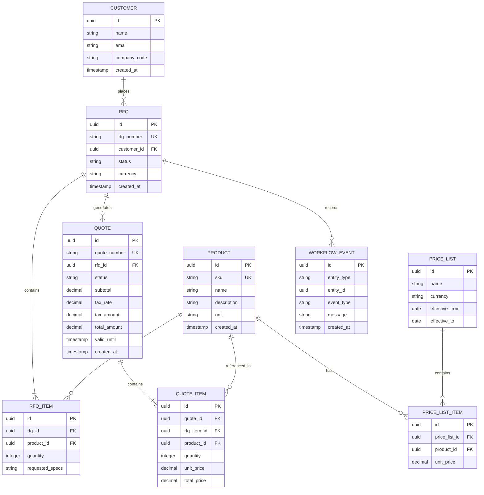

# Senior Developer Mastery Curriculum & Implementation Plan: AI RFQ & Quote Automation POC

This document serves as your **Permanent Architectural Guide** and **7-Day Senior Developer Concept Reading & Practice Curriculum** for building, packaging, deploying, and running CI/CD for the **RFQ to Quote Automation POC**.

---

## 1. Project Directory Structure

```text
rfq-to-quote-automation-poc/
├── .github/
│   └── workflows/
│       └── ci-cd.yml                        <-- GitHub Actions CI/CD Pipeline
├── README.md                                 <-- Project Documentation & Problem Statement
├── SENIOR_DEV_CURRICULUM.md                 <-- This Senior Developer Guide & Curriculum
└── rfq-service/                              <-- Spring Boot Application Module
    ├── .mvn/                                 <-- Maven Wrapper Files
    ├── mvnw                                  <-- Linux/macOS Maven Wrapper script
    ├── mvnw.cmd                              <-- Windows Maven Wrapper script
    ├── pom.xml                               <-- Maven Dependencies & Build Configuration
    └── src/
        ├── main/
        │   ├── java/
        │   │   └── com/
        │   │       └── automation/
        │   │           └── rfq/
        │   │               ├── RfqServiceApplication.java   <-- Spring Boot Main Entrypoint
        │   │               ├── config/
        │   │               │   └── OpenApiConfig.java       <-- Swagger / OpenAPI Config
        │   │               ├── controller/                  <-- REST API Layer
        │   │               │   ├── RfqController.java
        │   │               │   ├── QuoteController.java
        │   │               │   ├── ProductController.java
        │   │               │   └── WorkflowEventController.java
        │   │               ├── domain/                      <-- JPA Domain Entities & Enums
        │   │               │   ├── Customer.java
        │   │               │   ├── Product.java
        │   │               │   ├── PriceList.java
        │   │               │   ├── PriceListItem.java
        │   │               │   ├── Rfq.java
        │   │               │   ├── RfqItem.java
        │   │               │   ├── RfqStatus.java
        │   │               │   ├── Quote.java
        │   │               │   ├── QuoteItem.java
        │   │               │   ├── QuoteStatus.java
        │   │               │   └── WorkflowEvent.java
        │   │               ├── dto/                         <-- Request/Response Java 21 Records
        │   │               │   ├── CreateRfqRequest.java
        │   │               │   ├── AddRfqItemRequest.java
        │   │               │   ├── RfqResponse.java
        │   │               │   ├── GenerateQuoteRequest.java
        │   │               │   ├── QuoteResponse.java
        │   │               │   ├── ProductResponse.java
        │   │               │   └── WorkflowEventResponse.java
        │   │               ├── exception/                   <-- Global Exception Handling
        │   │               │   ├── GlobalExceptionHandler.java
        │   │               │   ├── ResourceNotFoundException.java
        │   │               │   └── BusinessRuleViolationException.java
        │   │               ├── repository/                  <-- Spring Data JPA Repositories
        │   │               │   ├── CustomerRepository.java
        │   │               │   ├── ProductRepository.java
        │   │               │   ├── PriceListRepository.java
        │   │               │   ├── PriceListItemRepository.java
        │   │               │   ├── RfqRepository.java
        │   │               │   ├── QuoteRepository.java
        │   │               │   └── WorkflowEventRepository.java
        │   │               └── service/                     <-- Core Business Logic & Pricing Engine
        │   │                   ├── PricingEngineService.java
        │   │                   ├── ProductCatalogService.java
        │   │                   ├── RfqService.java
        │   │                   ├── QuoteService.java
        │   │                   └── WorkflowEventService.java
        │   └── resources/
        │       ├── application.properties                   <-- Application Configuration & DB credentials
        │       └── db/
        │           └── migration/                           <-- Flyway SQL Migration Scripts
        │               ├── V1__create_rfq_quote_schema.sql
        │               └── V2__seed_initial_data.sql
        └── test/
            └── java/
                └── com/
                    └── automation/
                        └── rfq/
                            ├── service/
                            │   └── QuoteServiceTest.java     <-- Unit Tests
                            └── integration/
                                └── RfqToQuoteIntegrationTest.java <-- End-to-End API Integration Tests
```

---

## 2. 📚 7-Day Senior Developer Concept Reading & Practice Curriculum

### Day 1: Spring Boot Auto-Config & Database Migrations (Flyway)
**Reading Concepts**:
- **Why Database Version Control?**: Difference between `hibernate.hbm2ddl.auto=update` (dangerous for production data loss) and Flyway versioned SQL scripts.
- **PostgreSQL Data Types**: Using `UUID` for non-sequential primary keys (prevents ID enumeration attacks) and `NUMERIC(19,4)` for precise currency amounts without floating-point rounding errors.
- **Spring Boot Mechanics**: How `@SpringBootApplication` combines `@Configuration`, `@EnableAutoConfiguration`, and `@ComponentScan`.
**Practice Task**: Inspect `V1__create_rfq_quote_schema.sql` and verify Flyway startup logs when starting Spring Boot.

---

### Day 2: Domain-Driven Design (DDD) & JPA Performance Optimization
**Reading Concepts**:
- **Domain Invariants**: Enforcing business integrity directly inside domain entities rather than scattering checks across controllers.
- **JPA Relationship Pitfalls**: Understanding `FetchType.LAZY` vs `FetchType.EAGER` and solving the infamous **N+1 Query Problem** using `@EntityGraph` or JOIN FETCH.
- **Enum Mapping**: Using `@Enumerated(EnumType.STRING)` to persist readable text (`DRAFT`, `SUBMITTED`) instead of brittle ordinal numbers (`0`, `1`).
**Practice Task**: Inspect entities (`Rfq`, `Quote`, `Product`) with proper lazy fetch relationships and custom builder methods.

---

### Day 3: Modern Java 21 Records, DTO Pattern & Bean Validation
**Reading Concepts**:
- **Why DTOs Are Mandatory**: Security (preventing over-posting attacks), API version decoupling, and domain model protection.
- **Java 21 Records**: Immutability by design, compact constructors, automatic getters, `equals()`, `hashCode()`, and `toString()`.
- **Jakarta Bean Validation**: Declarative input constraints (`@NotNull`, `@NotBlank`, `@Positive`, `@Email`).
**Practice Task**: Review request and response DTO records (`CreateRfqRequest`, `GenerateQuoteRequest`, `QuoteResponse`).

---

### Day 4: Core Engine Architecture & Transaction Management
**Reading Concepts**:
- **Spring `@Transactional` Mechanics**: How Spring uses AOP (Aspect-Oriented Programming) proxies to intercept method calls, open DB connections, handle commit/rollback, and proxy pitfalls (calling self-methods).
- **Pricing Engine Design**: Separating pricing calculation rules (unit price lookup, quantity tiering, tax rates) into stateless pure functions.
- **Audit Logging Pattern**: Asynchronous vs synchronous event persistence (`WorkflowEvent`) for system observability.
**Practice Task**: Review `PricingEngineService` and `QuoteService` with transactional boundaries.

---

### Day 5: RESTful API Standards & Enterprise Error Handling
**Reading Concepts**:
- **RESTful Resource URI Design**: Standardizing API paths (`/api/v1/rfqs/{id}/items`), HTTP methods (`POST`, `GET`), and HTTP status codes (`201 Created`, `400 Bad Request`, `404 Not Found`).
- **RFC 7807 `ProblemDetail` Standard**: Standardized JSON error response formats in Spring Boot 3/4.
- **Swagger / OpenAPI 3.0**: Exposing self-documenting interactive API documentation.
**Practice Task**: Inspect REST Controllers and `@RestControllerAdvice` global exception handler.

---

### Day 6: Enterprise Testing Strategy (Testing Pyramid)
**Reading Concepts**:
- **The Testing Pyramid**: Unit Tests (fast, isolated) ──► Slice Tests (`@WebMvcTest`, `@DataJpaTest`) ──► End-to-End Integration Tests (`@SpringBootTest`).
- **Mockito Best Practices**: Mocking dependencies, stubbing returns (`when(...).thenReturn(...)`), and asserting invocations (`verify(...)`).
- **Test Idempotency**: Ensuring tests can run repeatedly in any order without dirtying the database state.
**Practice Task**: Run `./mvnw test` to execute `QuoteServiceTest` and `RfqToQuoteIntegrationTest`.

---

### Day 7: DevOps, Executable Fat JARs & CI/CD Automation
**Reading Concepts**:
- **Spring Boot Fat JAR Packaging**: How `spring-boot-maven-plugin` packages nested JARs into an executable archive.
- **12-Factor App Principles**: Externalizing configuration via environment variables (`SPRING_DATASOURCE_URL`).
- **Continuous Integration (CI)**: Automating code compilation, linting, unit testing, and artifact generation on GitHub Actions.
- **Conventional Commit Messages**: Standardizing Git history (`feat:`, `fix:`, `docs:`, `test:`).
**Practice Task**: Build fat JAR locally (`./mvnw clean package`), test `java -jar`, inspect `.github/workflows/ci-cd.yml`, and push code to GitHub.

---

## 3. Database Schema Design (PostgreSQL ER Diagram)



---

## 4. How to Run the Application & Deploy Standalone

### 1. Build Executable Fat JAR
```bash
cd rfq-service
./mvnw clean package -DskipTests
```
*Output Artifact*: `rfq-service/target/rfq-service-0.0.1-SNAPSHOT.jar`

### 2. Run Application JAR Standalone
```bash
java -jar rfq-service/target/rfq-service-0.0.1-SNAPSHOT.jar
```

Or pass database credentials dynamically:
```bash
java -Dspring.datasource.url=jdbc:postgresql://localhost:5432/rfq_db \
     -Dspring.datasource.username=postgres \
     -Dspring.datasource.password=postgres \
     -jar rfq-service/target/rfq-service-0.0.1-SNAPSHOT.jar
```

### 3. Open Interactive Swagger UI Documentation
Navigate to `http://localhost:8080/swagger-ui.html` in your web browser.

---

## 5. Git Push Strategy to GitHub

```bash
git init
git add .
git commit -m "feat: complete RFQ-to-Quote automation POC with Flyway, Swagger & CI/CD pipeline"
git branch -M main
git remote add origin <YOUR_GITHUB_REPO_URL>
git push -u origin main
```
